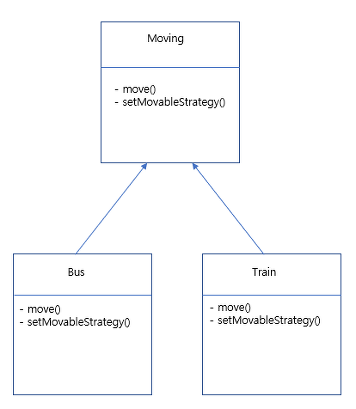

## 전략 패턴 ( Strategy Pattern )
- 유사한 행위들을 캡슐화하는 인터페이스를 정의.
- 객체의 행위를 동적으로 바꾸고 싶은 경우 직접 행위를 수정하지 않고 <br/><b>전략을 바꿔주기만 함으로써 행위를 유연하게 확장하는 방법.</b>

<br/>

#### 전략 패턴 사용 이유

```java
public class Moving {
    private MovableStrategy movableStrategy;

    public void move(){
        movableStrategy.move();
    }

    public void setMovableStrategy(MovableStrategy movableStrategy){
        this.movableStrategy = movableStrategy;
    }
}
```
```java
public class Bus extends Moving{

}
```
```java
public class Train extends Moving{
}
```

<br/>

전략 패턴을 사용하면 프로그램 상으로 로직이 변경 되었을 때, <u>유연하게 수정</u>할 수 있습니다.
```java
public class Client {
    public static void main(String args[]){
        Moving train = new Train();
        Moving bus = new Bus();

        /*
            기존의 기차와 버스의 이동 방식
            1) 기차 - 선로
            2) 버스 - 도로
         */
        train.setMovableStrategy(new RailLoadStrategy());
        bus.setMovableStrategy(new LoadStrategy());

        train.move();
        bus.move();

        /*
            선로를 따라 움직이는 버스가 개발
         */
        bus.setMovableStrategy(new RailLoadStrategy());
        bus.move();
    }
}
```