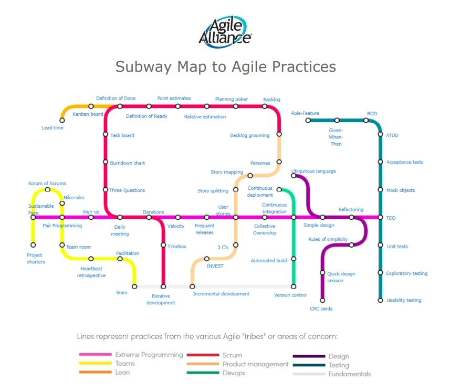

<html>
<body>
    
I'm spending some time formalizing my understanding of agile methodologies, and I was delighted to discover how pretty and informative the <a href="https://lnkd.in/gXcuq3-j" target="_blank">Agile Alliance website</a> is.

    
    
One aspect in particular that I liked was their "subway map" of the whole Agile workflow.

    
    
I find that I sometimes have familiarity with seemingly disparate concepts, without ever knowing just how related or complimentary they actually are. I liken it to moving to a new area, where you use your GPS to get to your job every day. Each day the GPS may take you on 1 of the 3 possible routes to your job. For a time, each of these 3 routes lives individually in its own slice of your world, unrelated. Eventually, you turn off the GPS, and realize with an internalized bird's-eye view exactly how each road flows in relation to the other 2.

    
    
Likewise, I find that the subway map of Agile Workflows showed me where the things I already knew fit into the bigger picture of a proper Agile system.

    
    
For years I've used Kanban boards for my projects on GitHub project space. I use this project tracking system and the issue tracking system both to help keep my head on straight with both solo and team projects both in and outside of school. I even Kanban aspects of my life, from home improvement projects to vacation planning.

    
    
A couple of summers ago, I worked with a retired game industry developer/mentor. He taught me, as I've mentioned in previous posts, about "Daily Standup Meetings," which is another aspect in the Agile framework under the "Scrum Tribe." Standups are something I actively perform to this day in my Obsidian-based markdown journal. He also taught me other concepts that fall under this Scrumbrella, such as backlogs and sprints.

    
    
Working in various team compositions over the years has exposed me to a lot of dysfunctional teams, middle-of-the-road teams, and epic-still-good-friends teams. The teams that were successful in their goals were always the ones that practiced at least some of the methodologies from the house of Agile.

    
    
Thank you for your time! -Josh ✌

    
    
<strong>P.S.</strong> Check out the map, it's insightful and information-rich.

    

</body>

</html>

