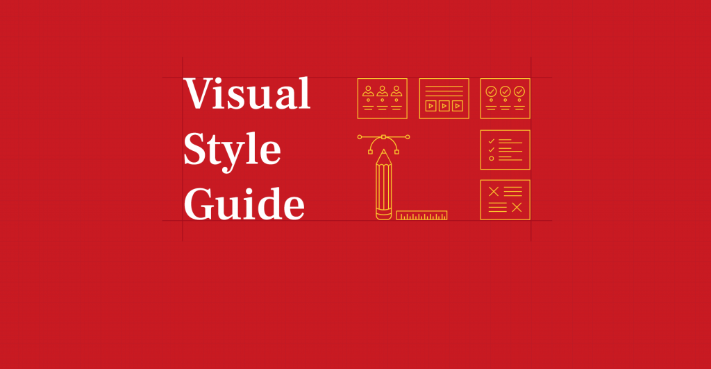

<h1 class="text-center"> devlopr jekyll - Styleguide </h1>

 
 

 Lets try the different text styles  <b> Bold </b> , <strong> Strong </strong>, <em> Emphasis </em>, <i> Italic </i> 

 Now, lets try different heading styles : 

<h1> Hello in h1 ! </h1>
<h2> Hello in h2 ! </h2>
<h3> Hello in h3 ! </h3>
<h4> Hello in h4 ! </h4>
<h5> Hello in h5 ! </h5>
<h6> Hello in h6 ! </h6>

 Unordered List 

<ul>
<li> List Item 1 </li>
<li> List Item 2 </li>
<li> List Item 3 </li>
<li> List Item 4 </li>
<li> List Item 5 </li>
</ul>

 Ordered List 
 
<ol>
<li> List Item 1 </li>
<li> List Item 2 </li>
<li> List Item 3 </li>
<li> List Item 4 </li>
<li> List Item 5 </li>
</ol>

<blockquote> 

This is a Block Quote,  It can Expand Multiple Lines 

</blockquote>

You can use the mark tag to <mark>highlight</mark> text. 

<del> This line of text is meant to be deleted text </del> 

<u>This line of text will render as underlined</u>

<small>This line of text is meant to be treated as fine print.</small>

<strong>This line rendered as bold text.</strong>

<em>This line rendered as italicized text.</em>

<abbr title="attribute">attr</abbr>

<abbr title="HyperText Markup Language" class="initialism">HTML</abbr>

<table>
      <thead>
        <tr>
          <th scope="col">#</th>
          <th scope="col">Heading</th>
          <th scope="col">Heading</th>
          <th scope="col">Heading</th>
          <th scope="col">Heading</th>
          <th scope="col">Heading</th>
          <th scope="col">Heading</th>
          <th scope="col">Heading</th>
          <th scope="col">Heading</th>
          <th scope="col">Heading</th>
        </tr>
      </thead>
      <tbody>
        <tr>
          <th scope="row">1</th>
          <td>Cell</td>
          <td>Cell</td>
          <td>Cell</td>
          <td>Cell</td>
          <td>Cell</td>
          <td>Cell</td>
          <td>Cell</td>
          <td>Cell</td>
          <td>Cell</td>
        </tr>
        <tr>
          <th scope="row">2</th>
          <td>Cell</td>
          <td>Cell</td>
          <td>Cell</td>
          <td>Cell</td>
          <td>Cell</td>
          <td>Cell</td>
          <td>Cell</td>
          <td>Cell</td>
          <td>Cell</td>
        </tr>
        <tr>
          <th scope="row">3</th>
          <td>Cell</td>
          <td>Cell</td>
          <td>Cell</td>
          <td>Cell</td>
          <td>Cell</td>
          <td>Cell</td>
          <td>Cell</td>
          <td>Cell</td>
          <td>Cell</td>
        </tr>
      </tbody>
    </table>
    
 

<h3>YouTube Responsive Embed</h3>

<iframe width="560" height="315" src="https://www.youtube.com/embed/nuwjUZCSB2Y?rel=0&amp;controls=0&amp;showinfo=0" frameborder="0" allow="autoplay; encrypted-media" allowfullscreen=""></iframe>

<h3>Vimeo Responsive Embed</h3>

<iframe src="https://player.vimeo.com/video/212114694?title=0&amp;byline=0&amp;portrait=0" width="640" height="360" frameborder="0" webkitallowfullscreen="" mozallowfullscreen="" allowfullscreen=""></iframe>

<h3 id="ted-responsive-embed">TED Responsive Embed</h3>

<iframe src="https://embed.ted.com/talks/ted_halstead_a_climate_solution_where_all_sides_can_win" width="640" height="360" frameborder="0" scrolling="no" allowfullscreen=""></iframe>

<h3 id="twitch-responsive-embed">Twitch Responsive Embed</h3>

<iframe src="https://player.twitch.tv/?autoplay=false&amp;video=v248755437" frameborder="0" allowfullscreen="true" scrolling="no" height="378" width="620"></iframe>

<h3 id="soundcloud-embed">SoundCloud Embed</h3>

<iframe width="100%" height="166" scrolling="no" frameborder="no" src="https://w.soundcloud.com/player/?url=https%3A//api.soundcloud.com/tracks/29738591&amp;color=ff5500&amp;auto_play=false&amp;hide_related=false&amp;show_comments=true&amp;show_user=true&amp;show_reposts=false"></iframe>

<h3 id="codepen-embed">CodePen Embed</h3>

<h3 id="syntax-highlighting">Syntax Highlighting</h3>

<figure class="highlight"><pre><code class="language-js" data-lang="js">'use strict';
var markdown = require('markdown').markdown;
function Editor(input, preview) {
  this.update = function() {
    preview.innerHTML = markdown.toHTML(input.value);
  };
  input.editor = this;
  this.update();
}</code></pre></figure>

You can add inline code just like this, E.g. <code class="highlighter-rouge">.code { color: #fff; }</code>

<figure class="highlight"><pre><code class="language-css" data-lang="css">pre {
  background-color: #f4f4f4;
  max-width: 100%;
  overflow: auto;
}</code></pre></figure>

<h3 id="github-gist-embed">GitHub gist Embed</h3>

<h3 id="input-style">Input Style</h3>

<input type="text" placeholder="I'm an input field!" />

<h3> Twitter Embed </h3>

<blockquote class="twitter-tweet" data-lang="en">
I just published “Deploying a blog using Jekyll and Github Pages with SSL certificate for Free” <a href="https://t.co/B3T3IQVU93">https://t.co/B3T3IQVU93</a>
&mdash; Sujay Kundu (@SujayKundu777) <a href="https://twitter.com/SujayKundu777/status/1012601950469160962?ref_src=twsrc%5Etfw">June 29, 2018</a></blockquote>

<h3> Instagram Embed </h3>

<blockquote class="instagram-media" data-instgrm-permalink="https://www.instagram.com/p/BhFTg6uhNRi/" data-instgrm-version="9" style=" background:#FFF; border:0; border-radius:3px; box-shadow:0 0 1px 0 rgba(0,0,0,0.5),0 1px 10px 0 rgba(0,0,0,0.15); margin: 1px; max-width:658px; min-width:326px; padding:0; width:99.375%; width:-webkit-calc(100% - 2px); width:calc(100% - 2px);">
 
 

<a href="https://www.instagram.com/p/BhFTg6uhNRi/" style=" color:#c9c8cd; font-family:Arial,sans-serif; font-size:14px; font-style:normal; font-weight:normal; line-height:17px; text-decoration:none;" target="_blank">A post shared by Ahmad Ajmi (@ahmadajme)</a> on <time style=" font-family:Arial,sans-serif; font-size:14px; line-height:17px;" datetime="2018-04-02T21:18:58+00:00">Apr 2, 2018 at 2:18pm PDT</time>

</blockquote> 

